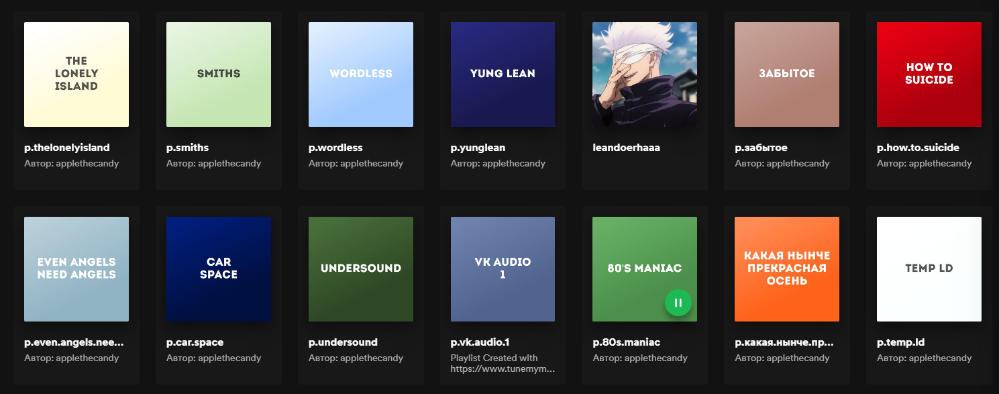

<h1 align="center">
  Playlist cover online generation
</h1>

##### Translatons:
* [Russian](readme_ru.md)
* [English](readme.md)

I use colored covers for music playlists. The color of the cover characterizes the mood conveyed by the playlist. This page has been created to simplify the process of creating covers.

I used Tailwind, Iso.js (Color Picker) and Brain.js (Choosing a text color)

The text color is generated depending on the background color, priority is given to white text color

Supports unicode

Spotify integration

Cover size - 600 x 600 px

[Demo](https://smolyakov.dev/playlists-generator/)

